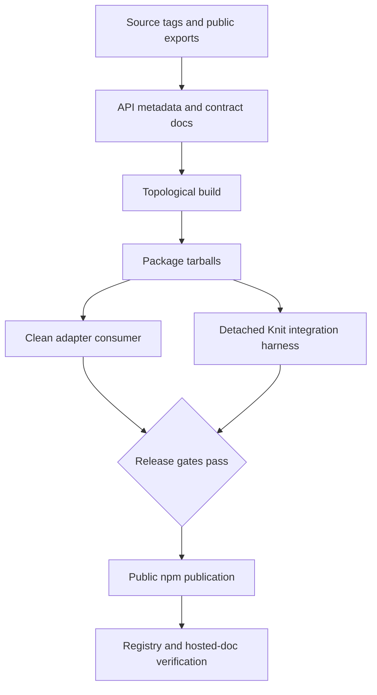
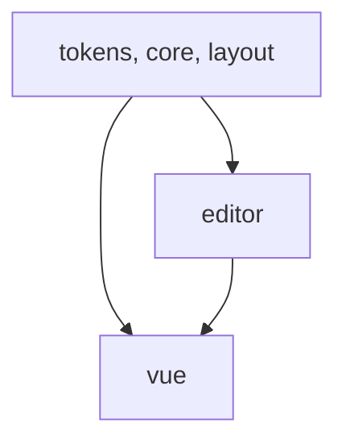

# Looma Release 1 Package Readiness - Plan

## Goal Capsule

- **Objective:** External applications can install a truthful, reproducible first Looma package release from a public registry, while Knit qualifies the deepest supported integration internally.
- **Means:** Define a `0.1.0` Candidate support contract, close generated-contract gaps, add package/release mechanics, and verify packed artifacts in clean consumers (KTD1–KTD6).
- **Authority:** Looma consumer needs define the public surface; Knit's release needs prioritize which supported combinations receive the deepest internal proof; Looma's component qualification and component contract guides govern that proof; published package metadata and docs must match runtime behavior.
- **Execution profile:** Correct the contract, qualify the release surface, pack-test, use Knit as the deepest pre-publication integration harness, publish, then verify registry and documentation results.
- **Stop conditions:** Stop publication for stale API metadata, inaccurate architecture claims, broken exports, missing npm ownership/provenance, failed clean install, or unresolved critical editor data loss.
- **Tail ownership:** The orchestrator owns registry verification, Knit integration-harness confirmation, documentation reachability, and the release record.

---

## Product Contract

### Summary

Looma R1 is public npm `0.1.0` Candidate, not a claim that the entire component roadmap is stable. Public distribution and install-first documentation serve arbitrary consuming applications, not a hypothetical Knit-developer audience. Knit is the private integration harness that determines which supported combinations receive the deepest R1 qualification.

### Problem Frame

Looma builds and tests locally, but every package is still `0.0.0`, there is no publish workflow or package provenance, and Knit consumes sibling source links. Generated API checks miss shipped components, public docs describe repository development rather than package installation, and architectural claims conflict with the shadow-DOM implementation. The repository is not yet a truthful public supply artifact.

### Key Decisions

- **R1 is Candidate `0.1.0`, not semver `1.0.0`.** The first release exposes useful packages while retaining room to close full Stable qualification gaps. Governs R1, R5, R8.
- **Knit prioritizes proof without defining the public boundary.** Tokens and layout receive deep package-integrity qualification; core, editor, and Vue additionally receive deep behavioral qualification because the internal Knit harness exercises them. React and Svelte remain in the repository but do not publish in R1. Governs R2, R5.
- **The component backlog does not block R1.** AlertDialog, Listbox, Combobox, Drawer, HoverCard, and later editor primitives remain roadmap work. Governs R9.

### Requirements

**Package contract**

- R1. Public runtime packages use one coherent `0.1.0` version, public access, complete license/repository/homepage metadata, npm provenance, and a documented topological publish order executed by a protected release workflow.
- R2. `@looma/tokens`, `@looma/layout`, `@looma/core`, `@looma/editor`, and `@looma/vue` publish installable artifacts; React and Svelte publication waits for behavioral parity evidence.
- R3. Every exported entry resolves from packed tarballs, with Looma internal dependencies rewritten to released versions and peer dependencies remaining external.
- R4. R1 is ESM-only unless a real CommonJS build is added; package export maps cannot advertise nonexistent module formats.

**Truthful qualification and documentation**

- R5. The Candidate support matrix states which SSR, accessibility, touch, browser, adapter, and editor guarantees are automated for each published package.
- R6. A classified source inventory marks every component tag published, internal, or deferred; generated API metadata, component docs, sidebars, and supported adapter maps cannot drift from the published inventory while the docs-sync gate passes.
- R7. ContextMenu and every Knit-consumed component have the required contract README covering semantics, SSR/no-JS behavior, mobile/touch behavior, and proof status.
- R8. Public architecture docs describe the actual shadow-DOM implementation and authored light-DOM/semantic fallback contract without claiming light-DOM rendering.
- R9. Deferred components and known editor limitations are named; the public release does not imply the future roadmap is included.

**Release proof**

- R10. CI runs build, docs-sync immutability, unit, SSR import, adapter render, accessibility, and real-browser overlay gates on the declared Node runtime.
- R11. A clean external fixture installs packed tarballs, imports every public entry, renders the Vue baseline, and consumes styles without workspace links.
- R12. A detached Knit integration harness installs the released core/editor/Vue artifacts and passes its build and signup-critical gates before Looma R1 is declared complete.
- R13. Public installation docs and hosted component documentation are reachable at production URLs and match package names and support status.

### Success Criteria

- Registry metadata and downloaded tarballs report `0.1.0`, public access, license, repository, and provenance for every published package.
- A clean consumer with no Looma source tree installs and imports every public entry.
- The detached Knit harness replaces sibling links with registry versions and completes its clean build.
- Generated component API count and names match the shipped source tags, including ContextMenu.
- Published docs make Candidate support and deferred surfaces visible, describe the real shadow-DOM fallback contract, and provide copyable install/import guidance.

### Acceptance Examples

- AE1. Given a clean project, when it installs the packed Looma package graph, then all public entry points import without reaching the Looma workspace.
- AE2. Given a new Stencil component tag without API metadata, docs navigation, or adapter mapping, when docs sync runs, then the gate fails with the missing surface.
- AE3. Given a CommonJS `require` of an ESM-only R1 package, then package metadata does not promise that unsupported path.
- AE4. Given server-side import without browser globals, then each supported public package imports safely and renders its declared fallback contract.
- AE5. Given Knit pinned to released Looma packages, then Knit builds and its signup-critical component tests pass from a standalone checkout.

### Scope Boundaries

#### Deferred to Follow-Up Work

- Full Stable qualification and semver `1.0.0`.
- React/Svelte publication and behavioral parity.
- Components and editor features listed as future work in `docs/component-roadmap.md` and `docs/editor-roadmap.md`.
- A CommonJS build, unless consumer evidence makes it necessary.

#### Outside This Release

- Finishing every Guildhall component task before publication.
- Product-specific workspace, page, auth, or data behavior owned by Knit.

### Dependencies

- A zero-mutation registry preflight confirms `@looma` scope ownership, exact package-name availability, public-package rights, 2FA/token policy, trusted-publishing eligibility, canonical repository identity, and an owner-approved fallback namespace before U1 starts.
- npm ownership and protected release-environment credentials for the `@looma` scope.
- A stable public documentation host and canonical repository URL.
- The Knit R1 branch is available as the release-candidate integration harness.

---

## Planning Contract

### Key Technical Decisions

- KTD1. **One synchronized `0.1.0` Candidate release.** Derive the package DAG from packed manifests, publish every approved tarball under a non-default `candidate` tag, verify the complete graph, then promote the same versions to `latest`. Supports R1–R3.
- KTD2. **Explicit Candidate support matrix.** Apply deep package-integrity qualification to tokens/layout and add behavioral qualification for Knit-consumed core/editor/Vue surfaces. React/Svelte are excluded from the R1 publish graph. Supports R2, R5, R10.
- KTD3. **Classified source-derived docs completeness.** Classify every source tag as published, internal, or deferred, then require API metadata, docs, navigation, and supported adapter projections for every published tag while failing on unclassified tags. Supports R6, R7.
- KTD4. **Truthful shadow-DOM architecture.** Document the implementation as shadow DOM with semantic authored children and declared fallback behavior; avoid a release-blocking light-DOM rewrite. Supports R8.
- KTD5. **Truthful module formats.** Remove false `require` exports, retain only real CommonJS targets, and test every declared entry graph. Supports R4.
- KTD6. **Approve and publish exact bytes.** A clean CI build emits checksummed tarballs and a release manifest; an isolated local registry supplies only those tarballs to fixtures and Knit, and publication targets those exact files. Supports R11, R12.

### High-Level Technical Design

### Assumptions

- The zero-mutation registry preflight records the approved package namespace before any contract or automation hard-codes it.
- Node 20 remains Looma's declared CI baseline for R1; clean consumer tests may additionally run on Node 24 to match Knit.
- The open editor table limitation `E-TBL-003` is fixed before publication or documented as an accepted Candidate limitation after confirming it cannot lose or corrupt data.
- GitHub is the canonical public source host only after the existing generic URLs are replaced with the actual repository URL.

### Sequencing

Correct completeness and architecture contracts before packaging, because package docs and release notes must be generated from truthful surfaces. Pack and consumer-test the exact artifacts before any registry write.

### Risk Analysis and Mitigation

- **First-publication bootstrap:** New npm packages cannot start with trusted publishing alone. Store a short-expiry, publish-only granular token for the exact five packages only in a protected GitHub release environment; never expose it to forks or pull requests; mask and audit logs; configure trusted publishing after first publication; revoke the token; and prove reuse fails.
- **Workflow compromise:** Release jobs run only by manual dispatch from the reviewed commit through a protected environment with required approval. Pin third-party actions to full SHAs, disable persisted checkout credentials, grant `contents: read` plus only the publication identity permission, and reject fork or pull-request execution.
- **Byte drift between approval and publish:** Lifecycle repacking could change files after Knit approval. Publish only the checksummed tarball paths in the release manifest and compare registry integrity before continuing.
- **Partial package graph:** A subset of immutable `0.1.0` versions could strand consumers. Keep all initial writes on `candidate`; resume only when published integrity matches, otherwise deprecate the defective synchronized set and rebuild as `0.1.1`.
- **Tag or docs cutover failure:** Snapshot prior dist-tags and docs deployment before promotion. Restore tags and the previous docs deployment when promotion verification fails; never try to reuse an immutable package version.
- **Public registry fallback during rehearsal:** Populate an isolated Verdaccio registry only from approved tarballs, clear package caches, capture redacted registry configuration plus the resulting lockfile, and fail any request for a Looma package outside that registry. Stored evidence strips auth tokens and authorization headers.

---

## Implementation Units

### U1. Define the R1 support and architecture contract

- **Goal:** Make the first public promise accurate and narrow enough to prove.
- **Requirements:** R2, R4, R5, R8, R9; AE3; KTD2, KTD4, KTD5.
- **Dependencies:** The zero-mutation registry preflight is recorded first.
- **Files:** `README.md`, `docs/architecture.md`, `docs/adapters.md`, `docs/component-qualification-guide.md`, `docs/component-roadmap.md`, `docs/editor-roadmap.md`, `docs/editor-bugs.md`, `docs/release-checklist.md`, `packages/layout/package.json`.
- **Approach:** Record the approved npm namespace before hard-coding it, publish a package/component support matrix, replace light-DOM claims with the actual shadow/fallback contract, state the real module formats (ESM-only editor/Vue and real ESM/CommonJS core/layout targets), and classify every package, source tag, backlog item, and editor limitation as published, internal, accepted, or deferred. Confirm Knit’s SSR toolchain and the docs server bundle consume the declared graph before locking that contract.
- **Test scenarios:**
  - Covers AE3. Every documented module format has a real built target and export.
  - The support matrix distinguishes Candidate and deferred surfaces without implying Stable parity.
  - A Knit-consumed component can be traced from its package export to its qualification evidence.
- **Verification:** Documentation and package metadata make no claim contradicted by source or build output.

### U2. Make generated component contracts complete

- **Goal:** Prevent shipped components from disappearing from API metadata, docs, navigation, or adapters.
- **Requirements:** R6, R7; AE2; KTD3.
- **Dependencies:** U1.
- **Files:** `tools/scripts/component-api-generator.mjs`, `tools/data/core-component-api.json`, `generated/component-api.json`, `apps/docs/docs/components/ui-context-menu.mdx`, `apps/docs/sidebars.ts`, `docs/adapters.md`, `packages/core/src/ui-context-menu/README.md`, `packages/core/src/ui-icon-button/README.md`, `packages/core/src/ui-menu-item/README.md`, `packages/core/src/ui-search-result-row/README.md`, `packages/core/src/ui-search-shell/README.md`, `packages/core/src/ui-select/README.md`, `packages/core/src/ui-textarea/README.md`, `packages/core/src/ui-top-bar/README.md`, `tools/scripts/component-api-generator.test.mjs`.
- **Approach:** Derive and classify the source tag set, compare published tags with every required projection, add missing ContextMenu surfaces and handcrafted contracts, and make CI reject unclassified tags or a dirty generation result.
- **Execution note:** Begin with a failing completeness fixture that adds a source tag without projections.
- **Test scenarios:**
  - Covers AE2. Missing API metadata fails docs sync.
  - A missing component doc, sidebar entry, or supported adapter map fails with the omitted tag name.
  - ContextMenu appears once in generated API, component docs, navigation, and each declared adapter surface.
  - Running generation on a clean repository produces no diff.
- **Verification:** The source tag inventory and every release projection are equal under the documented support matrix.

### U3. Add package and publication mechanics

- **Goal:** Produce versioned public tarballs with correct metadata and dependency edges.
- **Requirements:** R1–R4, R11; AE1, AE3; KTD1, KTD5, KTD6.
- **Dependencies:** U1.
- **Files:** `LICENSE`, `package.json`, `pnpm-workspace.yaml`, `packages/*/package.json`, `packages/*/README.md`, `packages/*/LICENSE`, `.github/workflows/release.yml`, `tools/scripts/verify-packages.mjs`, `tools/scripts/create-release-manifest.mjs`, `docs/release-checklist.md`, `tests/release/consumer/package.json`, `tests/release/consumer/src/index.ts`.
- **Approach:** Add a synchronized version/release workflow, public publish metadata, npm provenance, source-commit/toolchain/tarball integrity manifest, manifest-derived publish DAG, tarball-content validation, package-local license copies, and an isolated consumer fixture. Keep peers external and rewrite internal workspace ranges in publish artifacts. Restrict the workflow to manual protected-environment execution from the reviewed commit, pin third-party actions by full SHA, disable persisted checkout credentials, declare minimal permissions, and deny fork/PR release execution.
- **Execution note:** Prove packed tarballs locally before testing any registry command.
- **Test scenarios:**
  - Covers AE1. A fixture installs only tarballs and imports every documented entry.
  - Tarballs exclude source-only, test, local-config, and secret files while including runtime output, types, styles, loaders, license, and README.
  - Every tarball contains package-local license bytes identical to the approved root license.
  - Internal Looma dependencies resolve to the same release version and peers are not bundled as runtime duplicates.
  - The derived DAG rejects cycles, missing internal packages, or an order that would publish a dependent before its Looma dependencies.
  - Publication preflight rejects missing scope ownership, package-name collision, incompatible 2FA/token policy, wrong repository visibility/URL, unsupported runner/npm CLI, dirty tree, wrong version, or previously published version before registry mutation.
  - Release workflow policy tests reject pull-request, fork, unreviewed-commit, and unprotected-environment publication paths and verify minimal permissions plus SHA-pinned actions.
- **Verification:** The approved checksummed release manifest records source commit, toolchain, ordered package list, tarball file list/hash, planned tags, evidence locations, and accountable npm/docs/Knit release owners. Authenticity comes from the protected workflow, immutable release artifact, and npm provenance; separate manifest signing is outside R1.

### U4. Raise Candidate qualification gates

- **Goal:** Supply the minimum automated evidence promised by the R1 support matrix.
- **Requirements:** R5, R10, R11; AE4; KTD2.
- **Dependencies:** U1, U2, U3.
- **Files:** `.github/workflows/ci.yml`, `package.json`, `packages/core/package.json`, `packages/core/test/ssr-contract.spec.ts`, `packages/core/test-browser/release-overlays.spec.ts`, `packages/editor/package.json`, `packages/editor/test/editor-release-contract.spec.ts`, `packages/vue/src/index.test.ts`, `tests/release/consumer/src/index.ts`.
- **Approach:** Add SSR-safe import/render coverage, run real-browser overlay tests, replace the Vue adapter placeholder with import/render proof, add representative automated accessibility checks, and resolve or explicitly limit the open editor table defect.
- **Test scenarios:**
  - Covers AE4. Supported package entry points import without `window`, `document`, or custom-element registry globals.
  - ContextMenu provides a visible keyboard- and touch-operable trigger; right-click and long-press are supplemental, and keyboard selection, focus return, outside close, and cancellation pass in a real browser.
  - The Vue fixture registers and renders the declared baseline without duplicate custom-element definition or unresolved component warnings.
  - Representative form, menu, dialog, search, top-bar, and editor surfaces pass automated accessibility checks plus documented manual exceptions.
  - Editor table actions cannot lose document data; any accepted visual limitation is captured in the Candidate support matrix.
- **Verification:** CI runs every non-placeholder gate on the declared runtime and fails on unhandled warnings or skipped required browser scenarios.

### U5. Publish install-first documentation

- **Goal:** Let a consumer discover, install, and correctly evaluate Looma R1.
- **Requirements:** R6–R9, R13.
- **Dependencies:** U1–U4.
- **Files:** `apps/docs/docs/getting-started.md`, `apps/docs/docs/components/*`, `apps/docs/docusaurus.config.ts`, `apps/docs/sidebars.ts`, `.github/workflows/docs.yml`, `README.md`, `packages/*/README.md`.
- **Approach:** Replace repository-development onboarding with registry installation, show package-specific imports/styles, expose support status and known limitations, configure canonical URLs/repository links, and deploy a non-production preview. Production docs cut over only in U7 after candidate registry verification.
- **Test scenarios:**
  - A clean reader can install the relevant framework package and its peers from the getting-started guide.
  - Every published package links to its correct docs, repository, license, and support status.
  - The hosted docs build has no broken internal links and includes ContextMenu and the Knit-consumed editor slice.
  - Getting started, the support matrix, and a representative component page pass keyboard/focus, heading/landmark, automated accessibility, and 320-CSS-pixel reflow checks.
- **Verification:** Preview links, accessibility checks, package names, and install examples match the approved release manifest; production URL verification belongs to U7.

### U6. Prove Knit against release artifacts

- **Goal:** Use the priority product as the deepest pre-publication consumer.
- **Requirements:** R12; AE5; KTD6.
- **Dependencies:** U3, U4.
- **Files:** `tests/release/consumer/package.json`, `tests/release/consumer/src/index.ts`, `tests/release/registry/verdaccio.yaml`, `tests/release/registry/.npmrc`, `tools/scripts/local-registry.mjs`, `docs/component-qualification-guide.md`.
- **Approach:** Start and seed an isolated Verdaccio registry exclusively with approved tarballs, deny non-approved Looma requests, configure Knit to use it with an empty cache, then run Knit's clean install, build, and signup-critical component gates outside the Looma workspace. For R1, the release operator runs this in the shared Looma/Knit workspace against an explicit Knit commit and records that commit, its clean state, lockfile, commands, redacted registry logs, and results; the Looma workflow receives no Bitbucket credential.
- **Test scenarios:**
  - Covers AE5. Knit installs core/editor/Vue plus transitive Looma packages without sibling links.
  - Knit builds SSR output and renders top bar, search shell, menu, toast, floating action button, and editor surfaces without hydration or registration warnings.
  - A missing runtime file or incorrect export in any tarball fails before publication.
  - Registry/request logs and the Knit lockfile prove no workspace link or public-registry fallback supplied a Looma package.
- **Verification:** The release manifest identifies the exact tarball hashes Knit consumed, its source commit/lockfile, and the isolated registry evidence. The same local-registry flow is the sanctioned development override for validating unreleased Looma changes in Knit without a public publish.

### U7. Publish and verify Looma R1

- **Goal:** Release `0.1.0` publicly and verify the registry and documentation results.
- **Requirements:** R1–R3, R11–R13; AE1–AE5; KTD1.
- **Dependencies:** U5, U6.
- **Files:** `CHANGELOG.md`, `package.json`, `packages/*/package.json`, `.github/workflows/release.yml`.
- **Approach:** Publish exact manifest tarballs in dependency order under `candidate`, compare registry integrity after each write, reinstall the complete candidate graph into clean fixtures and Knit, cut over and verify production docs, then promote the same versions to `latest`. Create the immutable release record/tag, configure trusted publishing for every package, revoke the bootstrap token and prove reuse fails, and record accepted Candidate limitations.
- **Execution note:** Registry writes occur only after all dry-run, clean-consumer, and Knit integration-harness evidence is attached to the release candidate.
- **Test scenarios:**
  - Registry versions, `candidate` dist-tags, access, integrity, provenance, and dependency ranges match the approved release before any `latest` promotion.
  - A new cache-empty consumer installs from npm and repeats AE1.
  - Knit installs the public registry versions and repeats AE5.
  - A transient failure resumes at the first missing package only when every published integrity matches the manifest.
  - A defective or mismatched published artifact deprecates the synchronized `0.1.0` set and restarts qualification as `0.1.1`; no version is overwritten or reused.
  - A tag-promotion or docs-cutover failure restores the recorded prior tags/docs deployment.
  - After trusted publishing is configured, the retired bootstrap token is rejected by the registry and its revocation timestamp is recorded.
- **Verification:** The go/no-go ledger identifies the package manifest, gate evidence, source/Knit commits, accountable approvals, docs deployment, tag snapshot, registry integrity, trusted-publishing configuration, and bootstrap-token revocation for the same R1 artifact set.

---

## Verification Contract

| Gate | Applies to | Done signal |
|---|---|---|
| `pnpm check:docs-sync` on an unmodified tree | U2, U5 | Source tags and every generated/documented projection agree; generation leaves no diff. |
| `pnpm lint` and `pnpm typecheck` | U1–U6 | Source, tools, configs, and package types pass. |
| `pnpm test` | U2–U6 | All workspace tests run after their owning builds and pass. |
| Root build | U2–U6 | Packages, Storybook, and public docs build without release-blocking CSS or broken-link errors. |
| SSR and adapter matrix | U4 | Supported core/editor/Vue imports and renders pass without workspace coupling. |
| Real-browser/a11y gates | U4 | Required overlay, focus, keyboard, touch, and accessibility scenarios pass without skips. |
| Pack inspection and clean consumer | U3, U6 | Tarball contents/exports/dependencies pass outside the workspace. |
| Detached Knit integration harness | U6, U7 | Knit installs, builds, and passes signup-critical component tests using only approved/public artifacts. |
| Candidate registry verification | U7 | Every exact tarball has matching public metadata, integrity, provenance, dependency ranges, and `candidate` tag before graph promotion. |
| Promotion ledger | U7 | Accountable npm/docs approvers accept the complete graph and recorded Knit-harness evidence; docs and `latest` promotion preserve a restorable snapshot. |
| Support/architecture claim review | U1, U5 | A named reviewer confirms package support, module-format, and DOM claims against source, build output, and qualification evidence. |
| Hosted docs verification | U7 | Canonical production docs URLs and install examples are reachable and correct before `latest` promotion. |

---

## Definition of Done

- Every published package is `0.1.0`, publicly installable, licensed, documented, and traceable to provenance and a release record.
- Package exports and module-format claims match packed runtime files.
- Component API generation cannot omit a published tag or leave a source tag unclassified while passing CI.
- ContextMenu and all Knit-consumed components have contract docs and required proof.
- The public support matrix distinguishes Candidate, accepted limitations, and deferred roadmap work.
- Clean fixtures and standalone Knit consume the exact packed and then public registry artifacts.
- Hosted docs teach package installation rather than repository development and contain no placeholder domains or generic source links.
- npm and docs verification completes after publication, with a documented recovery path for partial failure.
- Experimental and abandoned implementation code from failed approaches is removed from the final diff.
