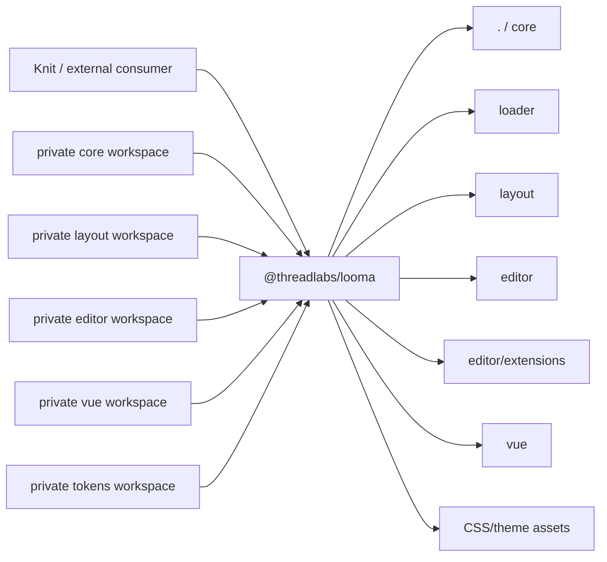
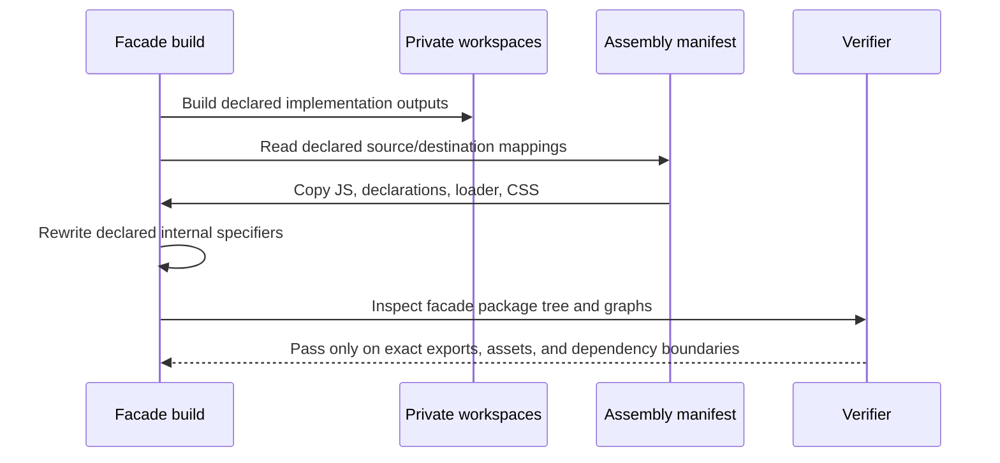
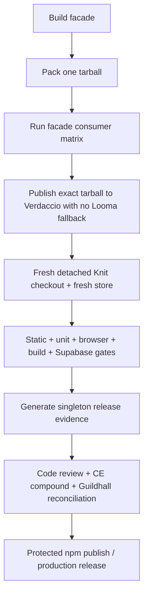

# Looma Public Facade Package

## Goal Capsule

**Objective:** Make Looma's public surface and Knit's integration release-ready so package complexity does not block the path to real signups.

**Means:** Replace Looma's unpublished five-package public Candidate with one coherent public package, `@threadlabs/looma`, preserve private internal workspaces, migrate Knit to that contract, and requalify the exact artifact in an isolated consumer with no Looma registry fallback.

## Product Contract

### Summary and problem frame

Looma is internally modular, but its current release projection asks consumers to install and understand five coordinated packages. Knit consequently carries several direct Looma dependencies and package-specific test configuration. None of those Candidate artifacts has been published, so Release 1 can establish a simpler contract without a public compatibility burden.

The desired developer experience is one installation and discoverable framework/feature subpaths:

```ts
import { openOverlay } from '@threadlabs/looma'
import { TopBar } from '@threadlabs/looma/vue'
import { getDefaultEditorExtensions } from '@threadlabs/looma/editor/extensions'
```

### Key decisions

1. **One public package.** `@threadlabs/looma` is the only Looma Release 1 npm artifact. This is session-settled and user-approved.
2. **Explicit subpaths, not root named adapter exports.** Framework and editor-extension code remain discoverable without making root consumers load Vue or Tiptap.
3. **Private modular implementation.** Existing workspaces may keep their internal `@threadlabs/looma-*` identities for builds, filters, and source imports, but they are not publishable products.
4. **Root equals core.** `@threadlabs/looma` and `@threadlabs/looma/core` expose the same core API. `loader`, `layout`, `editor`, `editor/extensions`, and `vue` are explicit boundaries.
5. **Exact-artifact qualification.** The prior five-package Candidate evidence is superseded. Release evidence must be rebuilt from one facade tarball and consumed by a detached Knit checkout without workspace or registry fallback.

### Requirements

- **R1:** Publish exactly one public package named `@threadlabs/looma` at Release 1.
- **R2:** Export `.`, `./core`, `./loader`, `./layout`, `./editor`, `./editor/extensions`, `./vue`, and every supported CSS/theme asset through an explicit `exports` map. Declare Vue and Tiptap as optional peers through `peerDependenciesMeta` so core-only installs do not acquire framework/editor peers.
- **R3:** Importing the root or `./core` must not resolve, execute, or require Vue or Tiptap.
- **R4:** `./editor` must remain Tiptap-free. `./editor/extensions` owns the Tiptap boundary; `./vue` owns the Vue boundary.
- **R5:** Preserve the intended ESM, CommonJS, TypeScript declaration, loader, and CSS contracts of the implementation packages.
- **R6:** All implementation/deferred adapter workspaces are private and have no public `publishConfig`.
- **R7:** Knit has exactly one direct Looma dependency and imports all Looma behavior/assets through facade subpaths.
- **R8:** Knit retains installed-package Vue test isolation: the facade Vue entry is inlined where needed and Looma boundary mocks use facade subpaths.
- **R9:** Release manifest, lockfile validation, generated registry data, component metadata, docs projections, and qualification evidence describe one artifact.
- **R10:** Local registry qualification permits the exact `@threadlabs/looma` package, disables upstream fallback for the facade and rejected old Looma identities, and retains the npm uplink only for unrelated third-party dependencies.
- **R11:** No current public documentation, generated output, executable release surface, or Knit runtime/test import presents `@threadlabs/looma-*` as a public consumer contract. Historical evidence may retain those names only with explicit supersession context.
- **R12:** A fresh detached Knit checkout must install the exact facade artifact from a local registry with no Looma fallback and pass the complete Release 1 gate set.
- **R13:** An install-first onboarding path starts with `pnpm add @threadlabs/looma`, explains when each supported subpath and optional peer is needed, and requires no knowledge of Looma's private workspace layout.

### Success criteria

- `npm pack` produces one facade tarball whose contents and export map pass package-integrity verification.
- A core-only consumer can import both root and `./core` without Vue or Tiptap installed.
- Dedicated consumers prove Vue and editor-extension entrypoints when their optional peers are installed.
- Knit installs one exact `@threadlabs/looma@0.1.0` artifact, with no workspace links or old Looma public identities, and passes static, unit, browser, build, and database/migration gates.
- Generated registry/docs state and Guildhall evidence agree on the single-artifact contract.

### Acceptance examples

- **AE1:** `import { openOverlay } from '@threadlabs/looma'` works in ESM and its supported CommonJS equivalent without Vue/Tiptap present.
- **AE2:** `import { TopBar } from '@threadlabs/looma/vue'` works when Vue is installed, and registration side effects still occur exactly as designed.
- **AE3:** `import { getDefaultEditorExtensions } from '@threadlabs/looma/editor/extensions'` works when Tiptap peers are installed; `@threadlabs/looma/editor` works without them.
- **AE4:** Knit source, tests, lockfile, and installed tree contain one direct Looma package identity.
- **AE5:** The qualification harness fails if an old package, a workspace link, an upstream registry, or an undeclared facade file masks an assembly defect.
- **AE6:** A first-time consumer can follow one current getting-started page from installation to core, CSS, Vue, and editor-extension imports without encountering an internal package name.

### Scope and dependencies

In scope: facade assembly, export/peer/side-effect metadata, implementation-package privacy, Looma release tooling and docs projections, Knit dependency/import/test migration, local-registry policy, exact-artifact qualification, Guildhall/CE learning reconciliation.

Out of scope: React/Svelte public adapters, publishing to npm, production deployment, and changing the internal modular architecture beyond what deterministic facade assembly requires.

The implementation depends on the current Looma workspace builds, pnpm, Node package export semantics, Verdaccio qualification infrastructure, Knit test/build tooling, Colima-backed Supabase tests, and Guildhall project state.

## Planning Contract

### Key technical decisions

- **KTD1 — facade owns the tarball:** add a publishable `packages/looma` workspace that is the sole public artifact. It is assembled from private implementation workspaces. This is session-settled and user-approved.
- **KTD2 — deterministic assembly:** a checked-in assembly manifest/script builds prerequisites, copies only declared outputs/assets into facade-owned directories, rewrites internal emitted specifiers to facade subpaths where necessary, and rejects stale/unexpected public identities.
- **KTD3 — explicit export map:** every supported JS, type, loader, and CSS entry is declared; no wildcard export hides missing or accidental files.
- **KTD4 — dependency isolation by entrypoint:** root/core and editor graphs are statically checked for forbidden Vue/Tiptap edges. Vue and editor-extension optional-peer failures occur only when those subpaths are used.
- **KTD5 — singleton release evidence:** manifests and generated projections are collapsed to `@threadlabs/looma`; existing scripts should continue iterating the manifest rather than acquiring facade-specific forks.
- **KTD6 — classify old identities:** internal build/filter references remain allowed; current consumer-facing/executable references migrate; dated plans and learnings retain their historical content while every retained old public identity receives explicit supersession context in the artifact or its current projection.
- **KTD7 — preserve installed-package isolation:** Knit Vitest inlines `@threadlabs/looma/vue`; mocks and CSS imports target facade subpaths so installed adapter registration is tested rather than bypassed.

### Public and internal topology



### Deterministic assembly



### Qualification and release sequence



### Export contract

| Public entry | Implementation source | Format | Peer boundary |
| --- | --- | --- | --- |
| `.` / `./core` | core | ESM + CJS + types | none |
| `./loader` | core loader | loader format + types as currently supported | none |
| `./layout` | layout | ESM + CJS + types | none |
| `./editor` | editor base | ESM + types | none |
| `./editor/extensions` | editor Tiptap extensions | ESM + types | Tiptap optional peers |
| `./vue` | Vue adapter | ESM + types | Vue optional peer |
| CSS/theme entries | tokens/layout/editor assets | CSS | none |

Supported CSS entries are explicit: `./tokens.css`, `./theme-light.css`, `./theme-dark.css`, `./theme-high-contrast.css`, `./layout.css`, `./styles.css`, and `./editor.css`, subject to verification against current implementation output names.

### Assumptions

- The five prior Candidate packages were never published, so no compatibility alias or deprecation release is required.
- Internal workspace names may remain stable to minimize unrelated build churn.
- Vue and Tiptap can be optional peers at package level while subpath and consumer tests enforce their practical boundaries.
- `prosemirror-tables` remains a runtime dependency if emitted editor-extension code requires it.
- Current historical plans and solution documents are evidence; implementation should add supersession context rather than rewriting history.

### Sequencing constraints

1. Freeze the facade contract before migrating generated outputs or Knit.
2. Build and verify the facade before making it the only release artifact.
3. Migrate Knit only against the locally packed facade, not workspace implementation packages.
4. Rebuild Candidate evidence from scratch; do not reuse the prior five-artifact result.
5. Run final code review, learning capture, and Guildhall reconciliation only after exact qualification.

### Risks and mitigations

- **Broken relative imports after copy:** declare and validate every copy/rewrite; scan packed JS/declarations for unresolved internal public specifiers.
- **Optional peers leaking into root:** install a minimal root consumer without Vue/Tiptap and inspect resolution/import graphs.
- **Tree shaking removes registration:** declare appropriate `sideEffects` entries and retain installed-package registration tests.
- **Facade contents drift from export map:** compare manifest, packed file list, and exports bidirectionally.
- **Registry fallback masks a missing Looma artifact:** disable proxying for the exact facade and rejected old Looma identities, retain npmjs proxying for unrelated third-party dependencies, and use a fresh pnpm store.
- **Historical/current identity ambiguity:** inventory references and classify each as internal, current-public, generated, or historical.

### Sources

- `CONCEPTS.md`
- `docs/solutions/architecture-patterns/npm-namespace-is-artifact-graph-identity.md`
- `docs/solutions/architecture-patterns/isolated-cross-project-candidate-qualification.md`
- `../knit/docs/solutions/test-failures/looma-vue-unit-test-browser-registration-isolation.md`
- Current Looma workspace manifests, release scripts, registry configuration, and Knit dependency/import/test surfaces.

## Implementation Units

### U1 — Freeze the one-package contract

**Changes:** Add the facade workspace manifest and explicit export/peer/side-effect contract. Add a machine-readable assembly mapping. Mark implementation and deferred adapter workspaces private and remove public publish metadata. Add a public-identity classifier/check that distinguishes internal and historical references from current consumer surfaces.

**Verification:** Validate manifests; assert exactly one publishable workspace; assert the assembly mapping and facade export declarations agree.

**Rollback boundary:** Manifest/privacy changes can be reverted without changing implementation output.

### U2 — Assemble and verify the facade runtime

**Changes:** Implement the deterministic facade build/assembly script. Preserve core loader relationships, copy layout/editor/Vue outputs and CSS into facade-owned paths, rewrite only declared internal emitted imports, and produce declarations at every JS entry. Add package-integrity, file-list, forbidden-import, ESM/CJS, optional-peer, CSS, Vue registration, and editor-extension consumer tests.

**Verification:** Build and pack from a clean state; run consumer matrix with separate minimal, Vue, and Tiptap environments; scan the tarball for forbidden specifiers and undeclared files.

**Rollback boundary:** Facade package and assembly tooling are additive until U3 changes release projections.

### U3 — Make the facade the only public Looma projection

**Changes:** Collapse release config and validation to one artifact. Update component metadata, the install-first getting-started path, docs examples, generated registry data, package links, and current release documentation to facade subpaths. Keep implementation workspace names only where explicitly classified as internal. Add supersession context to every historical artifact or current projection that retains an old public identity.

**Verification:** Regenerate and diff projections; run identity inventory; ensure current docs and generated outputs advertise only `@threadlabs/looma`; assert the singleton release manifest agrees with the facade package and export declarations.

**Rollback boundary:** Generated and documentation changes can be regenerated from the prior manifest if U3 is reverted as a unit.

### U4 — Migrate Knit to the facade

**Changes:** Replace all direct Looma dependencies with one facade dependency. Before public Candidate publication, the normal cross-repository checkout uses one local `link:../looma/packages/looma` dependency so Knit remains installable; qualification rewrites only its detached copy to exact `@threadlabs/looma@0.1.0` plus the local-registry scope rule and forbids `file:`/`link:` resolution there. At the protected publication cutover, commit the exact semver dependency only after that version is registry-available. Migrate runtime imports, dynamic imports, styles, mocks, and Vitest inline configuration to facade subpaths. Update preflight and installed-tree checks to require exactly one Looma artifact and reject workspace links/old public identities in qualification.

**Verification:** Install Knit from the packed facade, then run typecheck, lint/static checks, unit tests, focused Vue registration tests, browser tests, and production build.

**Rollback boundary:** Knit dependency/import migration is one coherent commit. Before protected publication, rollback reverts that commit and reinstalls the archived five-package Candidate tarballs; rebuilding them also requires reverting U1's implementation-workspace privacy changes.

### U5 — Collapse release and registry evidence

**Changes:** Update local-registry policy to disable proxying for exact `@threadlabs/looma` and rejected old Looma identities while retaining the npm uplink for unrelated dependencies. Make pack/publish/qualify/evidence scripts singleton-aware and prepare them to replace the prior Candidate inputs after the final gate run.

**Verification:** Start clean Verdaccio, publish only the facade tarball, and demonstrate that requests for old identities or missing facade files fail rather than fall through.

**Rollback boundary:** Qualification environment is ephemeral; evidence files are regenerated from immutable inputs.

### U6 — Requalify and reconcile

**Changes:** Provision the detached checkout's test environment, browser runtime, Colima, and Supabase stack; record which gates actually execute; then run the entire qualification in a fresh Knit checkout/store, including migration/RLS pgTAP gates. After the gates pass, regenerate the final tarball integrity, packed contents, installed tree, gate results, and singleton release evidence. Perform structured code review, simplify settled code if appropriate, capture a CE compound learning about facade assembly/qualification, append Guildhall task evidence, and update project memory/decisions so the old five-package model is explicitly superseded.

**Verification:** All Release 1 gates pass on exact source/artifact identities; both repos are clean; evidence timestamps and hashes match the final commits/tarball.

**Rollback boundary:** No protected publish/deploy occurs in this unit. A failed gate leaves the release unreleased and records replacement failure evidence.

## Verification Contract

The following gates are mandatory before the facade Candidate is considered release-ready:

1. Workspace/manifests: exactly one publishable Looma workspace and a valid explicit export map.
2. Facade integrity: deterministic clean build, exact packed file list, declaration presence, no unresolved/forbidden internal public specifiers.
3. Consumer matrix: root/core minimal environment in both ESM and CommonJS, loader, layout ESM+CJS, CSS, Vue adapter with Vue, editor base without Tiptap, editor extensions with Tiptap.
4. Knit identity: one exact `@threadlabs/looma` dependency, no old public Looma identities, no workspace links, fresh pnpm store.
5. Knit behavior: static/type/lint, unit and focused registration tests, browser tests, production build.
6. Data layer: Colima-backed Supabase starts cleanly; all migrations apply; full pgTAP RLS/migration suite passes.
7. Isolation: exact facade tarball is served by Verdaccio with no Looma fallback to a detached Knit checkout.
8. Evidence: release manifest, generated registry/docs, source commits, tarball integrity, installed tree, and gate log agree.
9. Review: CE code review has no unresolved release-blocking findings; relevant simplification is applied and reverified.
10. Continuity: CE compound and Guildhall project/task/memory state record the facade contract and supersede prior five-package Candidate assumptions.

## Definition of Done

- `@threadlabs/looma` is the sole public Looma Release 1 artifact in source, generated projections, tooling, documentation, and qualification evidence.
- Its explicit subpaths provide the agreed runtime, type, loader, and CSS behavior without leaking Vue/Tiptap into root/core/editor consumers.
- Knit consumes only the facade, passes the full exact-artifact detached qualification including database/RLS tests, and is ready for the separately authorized protected release/signup work.
- Both repositories are clean at reviewed commits; durable CE and Guildhall knowledge reflects the final contract.
- npm publication, production deployment, and real-user acquisition remain explicit protected follow-on actions unless separately authorized.
