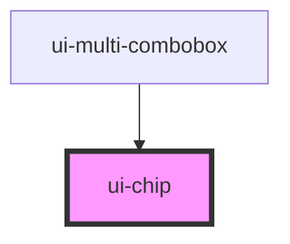

# ui-chip

<!-- Auto Generated Below -->

## Overview

A compact, non-interactive metadata label.

## Properties

| Property     | Attribute    | Description                                                                           | Type              | Default |
| ------------ | ------------ | ------------------------------------------------------------------------------------- | ----------------- | ------- |
| `appearance` | `appearance` | `tag` has a square leading edge and an angled trailing edge; `pill` is fully rounded. | `"pill" \| "tag"` | `'tag'` |
| `size`       | `size`       | Compact typography size.                                                              | `"sm" \| "xs"`    | `'xs'`  |

## Dependencies

### Used by

 - [ui-multi-combobox](../ui-multi-combobox)

### Graph

----------------------------------------------

*Built with [StencilJS](https://stenciljs.com/)*
