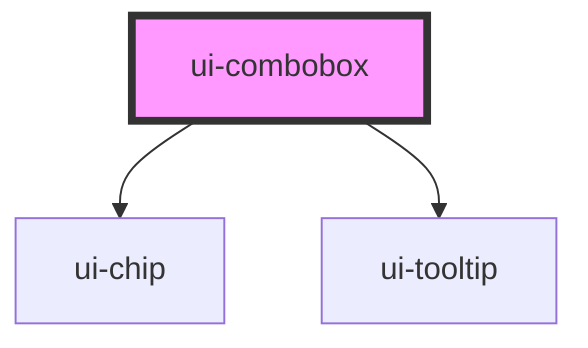

# ui-combobox

<!-- Auto Generated Below -->

## Overview

A single editable field with contextual suggestions, optional help and field validation.
With `multiple`, it becomes a multi-value tag field: `value` holds the selected
items, chips render before the cursor, and add/remove/create item events fire.

## Properties

| Property          | Attribute          | Description                                                                                                                                                       | Type                                     | Default     |
| ----------------- | ------------------ | ----------------------------------------------------------------------------------------------------------------------------------------------------------------- | ---------------------------------------- | ----------- |
| `clearable`       | `clearable`        |                                                                                                                                                                   | `boolean`                                | `false`     |
| `config`          | --                 | Immutable configuration; replace the object/context when dependencies change.                                                                                     | `ComboboxConfig`                         | `{}`        |
| `defaultQuery`    | `default-query`    |                                                                                                                                                                   | `string`                                 | `''`        |
| `defaultValue`    | `default-value`    |                                                                                                                                                                   | `string`                                 | `undefined` |
| `disabled`        | `disabled`         |                                                                                                                                                                   | `boolean`                                | `false`     |
| `disclosure`      | `disclosure`       |                                                                                                                                                                   | `boolean`                                | `false`     |
| `help`            | `help`             | Optional description shown by the connected question-mark button.                                                                                                 | `string`                                 | `''`        |
| `label`           | `label`            | Accessible visible label, associated with the native text input.                                                                                                  | `string`                                 | `''`        |
| `labelVisibility` | `label-visibility` | Keep the native label accessible while allowing compact composed controls.                                                                                        | `"sr-only" \| "visible"`                 | `'visible'` |
| `multiple`        | `multiple`         | Render selected values as removable chips before the cursor. `value` becomes the item list.                                                                       | `boolean`                                | `false`     |
| `name`            | `name`             |                                                                                                                                                                   | `string`                                 | `''`        |
| `placeholder`     | `placeholder`      |                                                                                                                                                                   | `string`                                 | `''`        |
| `query`           | `query`            | Controlled raw editing text; independent of canonical selection.                                                                                                  | `string`                                 | `undefined` |
| `readOnly`        | `readonly`         |                                                                                                                                                                   | `boolean`                                | `false`     |
| `required`        | `required`         |                                                                                                                                                                   | `boolean`                                | `false`     |
| `size`            | `size`             |                                                                                                                                                                   | `"md" \| "sm"`                           | `'md'`      |
| `tokenSeparators` | --                 | Characters that commit the current query and leave the input ready for the next item (multiple only).                                                             | `readonly string[]`                      | `[]`        |
| `value`           | `value`            | Controlled canonical value. Undefined selects uncontrolled mode; null means no selection. With `multiple`, this is the controlled list of selected items instead. | `readonly MultiComboboxItem[] \| string` | `undefined` |

## Events

| Event                   | Description                                                                               | Type                                                                                                   |
| ----------------------- | ----------------------------------------------------------------------------------------- | ------------------------------------------------------------------------------------------------------ |
| `add-item`              | Multiple mode: a suggestion or exact-match token was committed as a new item.             | `CustomEvent<MultiComboboxItemChange>`                                                                 |
| `create-entry`          |                                                                                           | `CustomEvent<ComboboxChange>`                                                                          |
| `create-item`           | Multiple mode: an unmatched query was submitted for creation.                             | `CustomEvent<MultiComboboxCreate>`                                                                     |
| `dependency-invalidate` |                                                                                           | `CustomEvent<ComboboxChange>`                                                                          |
| `free-entry`            |                                                                                           | `CustomEvent<ComboboxChange>`                                                                          |
| `options-change`        | Supplies the current result rows for framework-owned rich slots.                          | `CustomEvent<readonly ComboboxOption<unknown>[]>`                                                      |
| `query-change`          |                                                                                           | `CustomEvent<{ query: string; display: string; trigger: "keyboard" \| "pointer" \| "programmatic"; }>` |
| `remove-item`           | Multiple mode: a selected item was removed via chip keyboard controls.                    | `CustomEvent<MultiComboboxItemChange>`                                                                 |
| `validation-change`     |                                                                                           | `CustomEvent<ComboboxValidationState>`                                                                 |
| `value-change`          | Single mode: the ComboboxChange. Multiple mode: the full current item list on any change. | `CustomEvent<ComboboxChange \| readonly MultiComboboxItem[]>`                                          |

## Methods

### `focusInput() => Promise<void>`

Focus the native editing input from a composed control.

#### Returns

Type: `Promise<void>`

### `validate() => Promise<ComboboxValidationState>`

Validate for submission. Caller submits only non-pending, non-error output.

#### Returns

Type: `Promise<ComboboxValidationState>`

## Shadow Parts

| Part                 | Description |
| -------------------- | ----------- |
| `"affordance"`       |             |
| `"field"`            |             |
| `"group"`            |             |
| `"input"`            |             |
| `"item"`             |             |
| `"label"`            |             |
| `"option"`           |             |
| `"option-primary"`   |             |
| `"option-secondary"` |             |
| `"popup"`            |             |
| `"validation"`       |             |

## Dependencies

### Depends on

- [ui-chip](../ui-chip)
- [ui-tooltip](../ui-tooltip)

### Graph

----------------------------------------------

*Built with [StencilJS](https://stenciljs.com/)*
