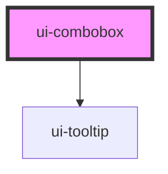

# ui-combobox

<!-- Auto Generated Below -->

## Overview

A single editable field with contextual suggestions, optional help and field validation.

## Properties

| Property       | Attribute       | Description                                                                               | Type             | Default     |
| -------------- | --------------- | ----------------------------------------------------------------------------------------- | ---------------- | ----------- |
| `clearable`    | `clearable`     |                                                                                           | `boolean`        | `false`     |
| `config`       | --              | Immutable configuration; replace the object/context when dependencies change.             | `ComboboxConfig` | `{}`        |
| `defaultQuery` | `default-query` |                                                                                           | `string`         | `''`        |
| `defaultValue` | `default-value` |                                                                                           | `string`         | `undefined` |
| `disabled`     | `disabled`      |                                                                                           | `boolean`        | `false`     |
| `disclosure`   | `disclosure`    |                                                                                           | `boolean`        | `false`     |
| `help`         | `help`          | Optional description shown by the connected question-mark button.                         | `string`         | `''`        |
| `label`        | `label`         | Accessible visible label, associated with the native text input.                          | `string`         | `''`        |
| `name`         | `name`          |                                                                                           | `string`         | `''`        |
| `placeholder`  | `placeholder`   |                                                                                           | `string`         | `''`        |
| `query`        | `query`         | Controlled raw editing text; independent of canonical selection.                          | `string`         | `undefined` |
| `readOnly`     | `readonly`      |                                                                                           | `boolean`        | `false`     |
| `required`     | `required`      |                                                                                           | `boolean`        | `false`     |
| `size`         | `size`          |                                                                                           | `"md" \| "sm"`   | `'md'`      |
| `value`        | `value`         | Controlled canonical value. Undefined selects uncontrolled mode; null means no selection. | `string`         | `undefined` |

## Events

| Event                   | Description                                                      | Type                                                                                                   |
| ----------------------- | ---------------------------------------------------------------- | ------------------------------------------------------------------------------------------------------ |
| `create-entry`          |                                                                  | `CustomEvent<ComboboxChange>`                                                                          |
| `dependency-invalidate` |                                                                  | `CustomEvent<ComboboxChange>`                                                                          |
| `free-entry`            |                                                                  | `CustomEvent<ComboboxChange>`                                                                          |
| `options-change`        | Supplies the current result rows for framework-owned rich slots. | `CustomEvent<readonly ComboboxOption<unknown>[]>`                                                      |
| `query-change`          |                                                                  | `CustomEvent<{ query: string; display: string; trigger: "keyboard" \| "pointer" \| "programmatic"; }>` |
| `validation-change`     |                                                                  | `CustomEvent<ComboboxValidationState>`                                                                 |
| `value-change`          |                                                                  | `CustomEvent<ComboboxChange>`                                                                          |

## Methods

### `validate() => Promise<ComboboxValidationState>`

Validate for submission. Caller submits only non-pending, non-error output.

#### Returns

Type: `Promise<ComboboxValidationState>`

## Shadow Parts

| Part                 | Description |
| -------------------- | ----------- |
| `"affordance"`       |             |
| `"field"`            |             |
| `"group"`            |             |
| `"input"`            |             |
| `"label"`            |             |
| `"option"`           |             |
| `"option-primary"`   |             |
| `"option-secondary"` |             |
| `"popup"`            |             |
| `"validation"`       |             |

## Dependencies

### Depends on

- [ui-tooltip](../ui-tooltip)

### Graph

----------------------------------------------

*Built with [StencilJS](https://stenciljs.com/)*
