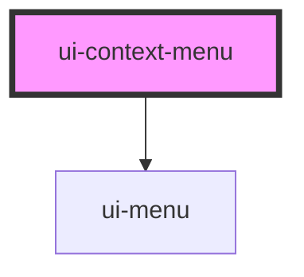

# ui-context-menu

A context menu with a required visible action path for keyboard and touch users.
Provide a native button in the `trigger` slot. The optional `for` attribute adds
right-click support to a larger target; it does not replace the visible trigger.

```html
<div id="document-row">
  <ui-context-menu for="document-row">
    <button slot="trigger" type="button">Document actions</button>
    <ui-menu-item value="rename">Rename</ui-menu-item>
    <ui-menu-item value="delete">Delete</ui-menu-item>
  </ui-context-menu>
</div>
```

The trigger opens by click, touch activation, `Enter`, `Space`, or `ArrowDown`.
The first enabled item receives focus. Selection, `Escape`, and outside press
close the menu and return focus to the trigger. Author-provided trigger and item
content remains usable and understandable before upgrade; popup positioning,
dismissal, and right-click enhancement require JavaScript.


<!-- Auto Generated Below -->


## Properties

| Property      | Attribute      | Description                                                                   | Type      | Default     |
| ------------- | -------------- | ----------------------------------------------------------------------------- | --------- | ----------- |
| `defaultOpen` | `default-open` | Opens the menu on first client render.                                        | `boolean` | `false`     |
| `for`         | `for`          | Optional id of the region that should also respond to a context-menu gesture. | `string`  | `undefined` |
| `open`        | `open`         | Controls the menu when the consumer owns open state.                          | `boolean` | `false`     |


## Dependencies

### Depends on

- [ui-menu](../ui-menu)

### Graph


----------------------------------------------

*Built with [StencilJS](https://stenciljs.com/)*
