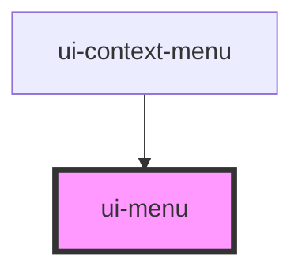

# ui-menu

<!-- Auto Generated Below -->

## Properties

| Property      | Attribute      | Description                                                            | Type                                                         | Default          |
| ------------- | -------------- | ---------------------------------------------------------------------- | ------------------------------------------------------------ | ---------------- |
| `defaultOpen` | `default-open` |                                                                        | `boolean`                                                    | `false`          |
| `for`         | `for`          | Id of the control that anchors this menu in the top layer.             | `string`                                                     | `undefined`      |
| `open`        | `open`         |                                                                        | `boolean`                                                    | `false`          |
| `placement`   | `placement`    | Preferred placement; Looma flips and shifts when space is constrained. | `"bottom-end" \| "bottom-start" \| "top-end" \| "top-start"` | `'bottom-start'` |

## Dependencies

### Used by

 - [ui-context-menu](../ui-context-menu)

### Graph

----------------------------------------------

*Built with [StencilJS](https://stenciljs.com/)*
