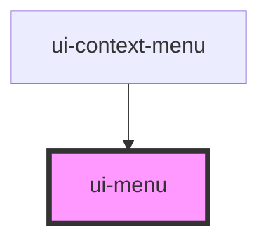

# ui-menu

<!-- Auto Generated Below -->

## Properties

| Property      | Attribute      | Description | Type      | Default |
| ------------- | -------------- | ----------- | --------- | ------- |
| `defaultOpen` | `default-open` |             | `boolean` | `false` |
| `open`        | `open`         |             | `boolean` | `false` |

## Dependencies

### Used by

 - [ui-context-menu](../ui-context-menu)

### Graph

----------------------------------------------

*Built with [StencilJS](https://stenciljs.com/)*
