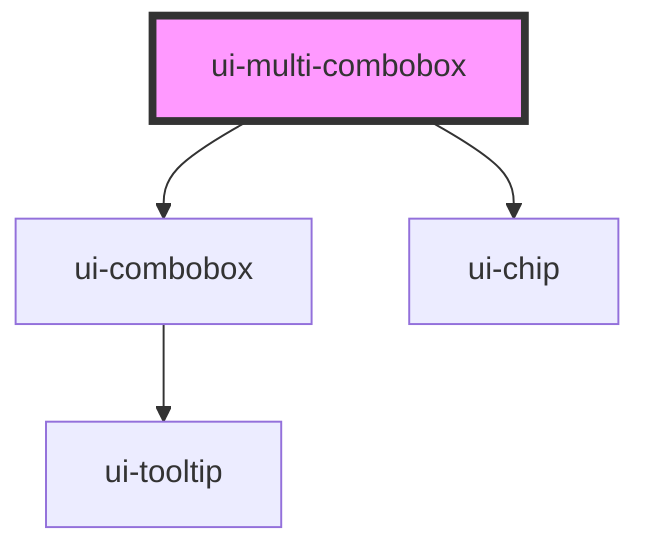

# ui-multi-combobox

<!-- Auto Generated Below -->

## Overview

A multi-value combobox with removable, customizable selected items.

## Properties

| Property       | Attribute       | Description | Type                           | Default     |
| -------------- | --------------- | ----------- | ------------------------------ | ----------- |
| `config`       | --              |             | `ComboboxConfig`               | `{}`        |
| `defaultQuery` | `default-query` |             | `string`                       | `''`        |
| `disabled`     | `disabled`      |             | `boolean`                      | `false`     |
| `items`        | --              |             | `readonly MultiComboboxItem[]` | `[]`        |
| `label`        | `label`         |             | `string`                       | `''`        |
| `name`         | `name`          |             | `string`                       | `''`        |
| `placeholder`  | `placeholder`   |             | `string`                       | `''`        |
| `query`        | `query`         |             | `string`                       | `undefined` |
| `readOnly`     | `readonly`      |             | `boolean`                      | `false`     |
| `required`     | `required`      |             | `boolean`                      | `false`     |

## Events

| Event            | Description | Type                                                                                                   |
| ---------------- | ----------- | ------------------------------------------------------------------------------------------------------ |
| `add-item`       |             | `CustomEvent<MultiComboboxItemChange>`                                                                 |
| `create-item`    |             | `CustomEvent<MultiComboboxCreate>`                                                                     |
| `options-change` |             | `CustomEvent<readonly ComboboxOption<unknown>[]>`                                                      |
| `query-change`   |             | `CustomEvent<{ query: string; display: string; trigger: "keyboard" \| "pointer" \| "programmatic"; }>` |
| `remove-item`    |             | `CustomEvent<MultiComboboxItemChange>`                                                                 |

## Methods

### `focusInput() => Promise<void>`

#### Returns

Type: `Promise<void>`

## Shadow Parts

| Part     | Description |
| -------- | ----------- |
| `"item"` |             |

## Dependencies

### Depends on

- [ui-combobox](../ui-combobox)
- [ui-chip](../ui-chip)

### Graph

----------------------------------------------

*Built with [StencilJS](https://stenciljs.com/)*
