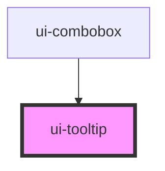

# ui-tooltip

<!-- Auto Generated Below -->

## Properties

| Property        | Attribute         | Description                                                                    | Type                                                         | Default       |
| --------------- | ----------------- | ------------------------------------------------------------------------------ | ------------------------------------------------------------ | ------------- |
| `defaultOpen`   | `default-open`    |                                                                                | `boolean`                                                    | `false`       |
| `for`           | `for`             |                                                                                | `string`                                                     | `''`          |
| `hideDelay`     | `hide-delay`      | Pointer leave grace period in milliseconds.                                    | `number`                                                     | `100`         |
| `open`          | `open`            | Controlled open state. Omit it to use defaultOpen and local interaction state. | `boolean`                                                    | `undefined`   |
| `placement`     | `placement`       |                                                                                | `"bottom-end" \| "bottom-start" \| "top-end" \| "top-start"` | `'top-start'` |
| `showDelay`     | `show-delay`      | Pointer hover intent delay in milliseconds. Keyboard focus is immediate.       | `number`                                                     | `500`         |
| `toggleOnClick` | `toggle-on-click` | Click or tap pins the description; activate again to dismiss.                  | `boolean`                                                    | `false`       |

## Events

| Event   | Description | Type                                                               |
| ------- | ----------- | ------------------------------------------------------------------ |
| `close` |             | `CustomEvent<{ open: boolean; reason: string; trigger: string; }>` |
| `open`  |             | `CustomEvent<{ open: boolean; reason: string; trigger: string; }>` |

## Dependencies

### Used by

 - [ui-combobox](../ui-combobox)

### Graph

----------------------------------------------

*Built with [StencilJS](https://stenciljs.com/)*
